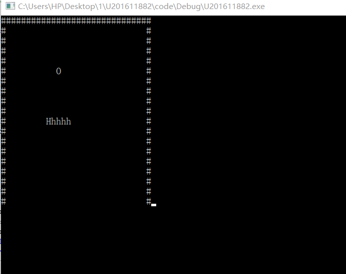

  #  
 **贪吃蛇代码** 
 
 ## **一、 简述思路**  
 1.利用二维数组0/1构建地图边界    
 2.利用二维数组构建蛇身体并实现移动  
 3.利用随即种子构建食物  
 4.判断是否吃到食物  
 5.利用kbhit函数检测是否按键  
 6.检测游戏结束条件   
  
 ##  ** 二、部分代码构建**   
  ### 1.所需调用库及初始化   
 ~~~ C++  
# include <stdio.h>
# include <string.h>//字符数组调用
# include <windows.h>
# include <stdlib.h>
# include <conio.h>  //控制台输入输出程序
# include <time.h>//随即种子

const  int length = 5;
const int line = 30;
const int row = 20;

//初始化
int head_x = row / 2, head_y = line / 2;
int head_v = 5;
int Tail_x = 0, Tail_y = 0;
int count = 0;
char direct = 'a';
void creatmap(char map[row][line]);//用来创建地图
void creatsnake(int snake[row][line]);
void  showmap(char map[row][line], int snake[row][line]);
void run(char map[row][line], int snake[row][line]);
int judge(void);
void creatfood(char map[row][line], int snake[row][line]);
void movetail(int snake[row][line]);
int eatfood(char  map[row][line], int snake[row][line]);  
~~~  
### 2.重要函数样例
（1）. 蛇身构建  
~~~ C++ 
void creatsnake(int snake[row][line])
{
	int i, j;
	int 	value = head_v=5;
	snake[head_x][head_y] = value;
	for (i = head_x, j = head_y+1; j < head_y + length;	++j)
	{
		snake[i][j] = --value;	
	
	
	}
	Tail_x = i;
	Tail_y = j-1;
}
~~~  
注释：同样是二维数组，给蛇头加上编号直到蛇尾为1，在最后现实中，对二维数组进行检验，如果存储得数为不为0，则输出字母（蛇身）。    
（2）.检验键盘是否敲下
~~~C++  
	if (kbhit()) {

		ch = getch();
		if (ch == -32) {

			sh = getch();
			switch (sh) {

			case 'H': direct = 'w'; break;
			case 'P': direct = 's'; break;
			case 'K': direct = 'a'; break;
			case 'M': direct = 'd'; break;
					}
				}
		else {
			switch (ch) {

			case 'w':case 'W': direct = 'w'; break;
			case 's':case 'S': direct = 's'; break;
			case 'a':case 'A': direct = 'a'; break;
			case 'd':case 'D': direct = 'd'; break;

					}
				}
			}
~~~  
注释：利用kbhit函数，分四种情况进行检验，之后再根据这四种情况进行蛇的移动。   
 ##  ** 三、最终样品**     
   
 ##  ** 四、存在缺陷**     
1.游戏界面枯燥没有新意  
2.游戏功能比较单一，下一步可以试着控制速度与显示结果  
3.尝试双人模式的贪吃蛇

