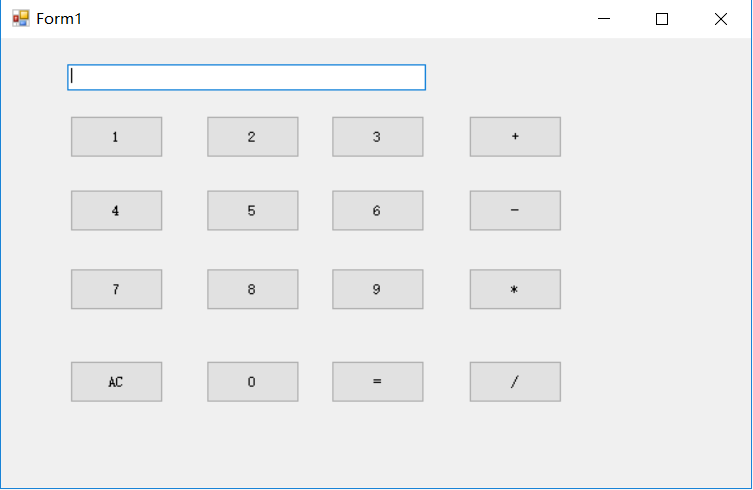

# <FONT color=#FFFF00><center>***预习demo介绍***

## **实现功能**
该程序是一个小计算器，可以实现十进制数字的加减乘除运算。清零键可以清除键盘上显示的数字，重新输入。主要的步骤有两点，一是**输入数字**，二是**进行四则运算**，并且在显示屏上**显示数字与答案**。其中输入数字时需要进行判断*是否处于运算状态*，即*前一步是否点击运算符*。
## **代码重现**

```C
using System;
using System.Collections.Generic;
using System.ComponentModel;
using System.Data;
using System.Drawing;
using System.Linq;
using System.Text;
using System.Threading.Tasks;
using System.Windows.Forms;

namespace WindowsFormsApp1
{
    public partial class Form1 : Form
    {
        double a = 0;//输出结果
        double b = 0;//输入的第一个数
        bool c = false;//true为运算，false为输入数
        string d;//显示框内文字
        public Form1()
        {
            InitializeComponent();
        }
        private void Form1_Load(object sender, EventArgs e)
        {

        }

        //button1到0是输入数字
        private void button1_Click(object sender, EventArgs e)
        {
            if (c == true)//判断是否处于待运算状态，如果是则令其为否，表示已经进行运算
            {
                textBox1.Text = "";
                c = false;
            }
            textBox1.Text += "1";//屏幕上显示点击的数值
        }

        private void button2_Click(object sender, EventArgs e)
        {
            if (c == true)
            {
                textBox1.Text = "";
                c = false;
            }
            textBox1.Text += "2";
        }

        private void button3_Click(object sender, EventArgs e)
        {
            if (c == true)
            {
                textBox1.Text = "";
                c = false;
            }
            textBox1.Text += "3";
        }

        private void button4_Click(object sender, EventArgs e)
        {2
            if (c == true)
            {
                textBox1.Text = "";
                c = false;
            }
            textBox1.Text += "4";
        }

        private void button5_Click(object sender, EventArgs e)
        {
            if (c == true)
            {
                textBox1.Text = "";
                c = false;
            }
            textBox1.Text += "5";
        }

        private void button6_Click(object sender, EventArgs e)
        {
            if (c == true)
            {
                textBox1.Text = "";
                c = false;
            }
            textBox1.Text += "6";
        }

        private void button7_Click(object sender, EventArgs e)
        {
            if (c == true)
            {
                textBox1.Text = "";
                c = false;
            }
            textBox1.Text += "7";
        }

        private void button8_Click(object sender, EventArgs e)
        {
            if (c == true)
            {
                textBox1.Text = "";
                c = false;
            }
            textBox1.Text += "8";
        }

        private void button9_Click(object sender, EventArgs e)
        {
            if (c == true)
            {
                textBox1.Text = "";
                c = false;
            }
            textBox1.Text += "9";
        }

        private void button11_Click(object sender, EventArgs e)
        {
            if (c == true)
            {
                textBox1.Text = "";
                c = false;
            }
            textBox1.Text += "0";
            if (d == "/")
            {
                textBox1.Clear();
                MessageBox.Show("除数不能为零", "错误提示", MessageBoxButtons.OK, MessageBoxIcon.Warning);
            }
        }
        //输入四个运算符
        private void button13_Click(object sender, EventArgs e)
        {
            c = true;
            b = double.Parse(textBox1.Text);
            d = "+";
        }

        private void button14_Click(object sender, EventArgs e)
        {
            c = true;
            b = double.Parse(textBox1.Text);
            d = "-";
        }

        private void button15_Click(object sender, EventArgs e)
        {
            c = true;
            b = double.Parse(textBox1.Text);
            d = "*";
        }

        private void button16_Click(object sender, EventArgs e)
        {
            c = true;
            b = double.Parse(textBox1.Text);
            d = "/";
        }
        //进行运算
        private void button12_Click(object sender, EventArgs e)
        {
            switch (d)
            {
                case "+": a = b + double.Parse(textBox1.Text); break;
                case "-": a = b - double.Parse(textBox1.Text); break;
                case "*": a = b * double.Parse(textBox1.Text); break;
                case "/": a = b / double.Parse(textBox1.Text); break;
            }
            textBox1.Text = a + "";
            c = true;
        }
        //AC键清零
        private void button10_Click(object sender, EventArgs e)
        {
            textBox1.Text = "";
        }
    }
}
```
## **运行界面**

## **优点缺点**
- 该程序比较简单，代码清晰明白，容易上手，便于C#的入门
- 操作界面直白，方便使用者使用
- 实现用途不多，无法发布
## **改进计划**
- 添加小数点按键，能够完成小数的运算
- 添加十进制二进制转换案件，用户可以选择二/十进制来计算
- 添加历史记录，用户可以查询计算历史
- 添加Ans案件调用前次计算结果
- 添加退格键，消去错误输入